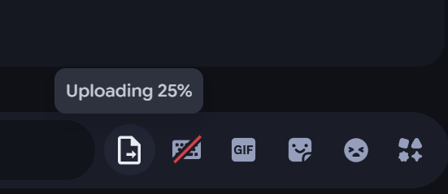
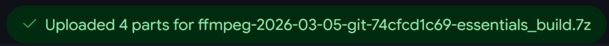
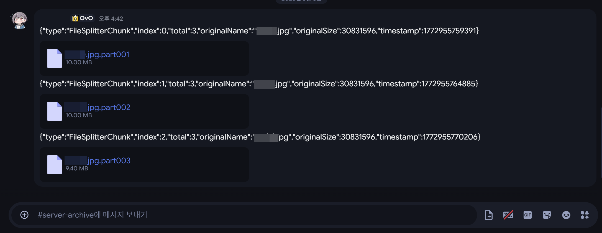

# FileSplitter - Vencord/Equicord Plugin

A Vencord/Equicord plugin that bypasses Discord's file size limit by automatically splitting large files during upload and merging them back together on download.

## Screenshots

### Splitting in progress


### Upload progress


### Upload complete


### Uploaded chunks in channel


## Features

- Automatically splits files into 10MB chunks for upload
- Auto-detects and merges chunks on the receiving end
- Chat bar icon button for easy file selection
- Toast notifications for upload progress
- Supports all file types
- Garbage collection for incomplete chunks (5-minute expiry)

## Installation

There are two ways to install this plugin:

### Method 1: Source Build (Recommended)

Build from source by placing the plugin in the `userplugins` directory.

#### Vencord

1. Clone the [Vencord](https://github.com/Vendicated/Vencord) source:
   ```bash
   git clone https://github.com/Vendicated/Vencord.git
   cd Vencord
   ```

2. Clone this plugin into the userplugins directory:
   ```bash
   git clone https://github.com/sioaeko/Vencord-splitLargeFile.git src/userplugins/fileSplitter
   cp src/userplugins/fileSplitter/FileSplitter.tsx src/userplugins/fileSplitter/index.tsx
   ```

3. Install dependencies and build:
   ```bash
   pnpm install
   pnpm build
   ```

4. Inject into Discord:
   ```bash
   pnpm inject
   ```

5. Restart Discord, then go to **Settings → Vencord → Plugins**, search for `FileSplitter`, and enable it.

#### Equicord

1. Clone the [Equicord](https://github.com/Equicord/Equicord) source:
   ```bash
   git clone https://github.com/Equicord/Equicord.git
   cd Equicord
   ```

2. Clone this plugin into the userplugins directory:
   ```bash
   git clone https://github.com/sioaeko/Vencord-splitLargeFile.git src/userplugins/fileSplitter
   cp src/userplugins/fileSplitter/FileSplitter.tsx src/userplugins/fileSplitter/index.tsx
   ```

3. Install dependencies and build:
   ```bash
   pnpm install
   pnpm build
   ```

4. Inject into Discord:
   ```bash
   pnpm inject
   ```

5. Restart Discord, then go to **Settings → Equicord → Plugins**, search for `FileSplitter`, and enable it.

> **Note**: The `src/userplugins/` directory is in `.gitignore` and must be created manually.

### Method 2: ASAR Direct Injection (Equicord only)

Directly inject the plugin into the already-installed Equicord ASAR bundle. No source build required.

> **Prerequisites**: Equicord must already be installed, and `@electron/asar` must be available.

1. **Back up your current ASAR** (if not already backed up):
   ```bash
   copy "%APPDATA%\Equicord\equicord.asar" "%APPDATA%\Equicord\equicord.asar.bak"
   ```

2. Clone this repository:
   ```bash
   git clone https://github.com/sioaeko/Vencord-splitLargeFile.git
   cd FileSplitter
   ```

3. Install the required dependency:
   ```bash
   npm install @electron/asar
   ```

4. Run the injection script:
   ```bash
   node inject_full.js
   ```

5. Restart Discord. The plugin will appear under **Plugins** as `FileSplitter`.

> **Note**: The injection script automatically extracts the ASAR backup, patches `renderer.js` with the plugin code, and writes it back. If something goes wrong, restore with:
> ```bash
> copy "%APPDATA%\Equicord\equicord.asar.bak" "%APPDATA%\Equicord\equicord.asar"
> ```

## Usage

### Sending Files

1. Click the **file split icon** (document icon) in the chat bar.
2. Select a file larger than 10MB.
3. The file is automatically split into 10MB chunks and uploaded.
4. Progress is shown via toast notifications.

### Receiving Files - With Plugin

If you have the plugin installed and enabled, everything is **automatic**:
1. Chunk messages are detected as they arrive in the channel.
2. Once all chunks are received, they are merged automatically.
3. The original file is downloaded with its original filename.

### Receiving Files - Without Plugin

If you don't have the plugin, you can manually merge the part files:

1. Download all `.part001`, `.part002`, `.part003`, ... files from the channel.
2. Save all parts to the **same folder**.

#### Windows (CMD)
```cmd
copy /b "filename.part001" + "filename.part002" + "filename.part003" "originalfile"
```

#### Windows (PowerShell)
```powershell
Get-Content "filename.part001","filename.part002","filename.part003" -Encoding Byte -ReadCount 0 | Set-Content "originalfile" -Encoding Byte
```

#### Linux / macOS
```bash
cat filename.part001 filename.part002 filename.part003 > originalfile
```

#### Python (for many parts)
```python
import glob

filename = "originalfile"
parts = sorted(glob.glob(f"{filename}.part*"))

with open(filename, "wb") as out:
    for part in parts:
        with open(part, "rb") as f:
            out.write(f.read())

print(f"Merged {len(parts)} parts into {filename}")
```

> **Important**: Parts must be merged in order. `.part001` → `.part002` → `.part003` ...

## Technical Details

| Item | Description |
|------|-------------|
| Chunk Size | 10MB (compatible with Discord free tier) |
| Max File Size | 500MB |
| File Formats | All formats supported |
| Metadata | JSON (sent as message content) |
| Upload Method | Discord CloudUploader + RestAPI |
| Chunk Expiry | 5 minutes (receiver-side garbage collection) |
| Part Naming | `filename.part001`, `filename.part002`, ... |

## Troubleshooting

**Q: Plugin doesn't show up in the Plugins list**
A: Run `pnpm build` and `pnpm inject` again, then fully restart Discord. If using Method 2, make sure `equicord.asar.bak` exists and re-run `node inject_full.js`.

**Q: Upload Failed 40005 error**
A: The file chunk exceeds Discord's upload limit. Try reducing the `CHUNK_SIZE` value in the plugin code (default: 10MB).

**Q: Auto-merge isn't working on the receiving end**
A: All chunks must be received in the same channel. Make sure the plugin is enabled.

**Q: Upload failed midway**
A: Check your internet connection and try again. Already-sent parts remain in the channel, so you can manually send the remaining parts.

**Q: "X is Not a constructor" error**
A: This can happen if the webpack module resolution fails. Try using Method 2 (ASAR injection) instead.

## Security

- All file processing is done locally on your device
- No external servers are used
- Files are transferred through Discord's CDN

## License

MIT License

## Credits

- Author: [sioaeko](https://github.com/sioaeko)
- Original concept: [ImTheSquid/SplitLargeFiles](https://github.com/ImTheSquid/SplitLargeFiles)

## Requirements

- Vencord or Equicord (source build required for Method 1)
- Discord Desktop Client
- Node.js 18+
- pnpm (Method 1) or npm (Method 2)
