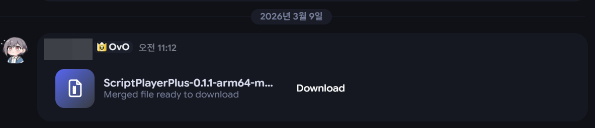
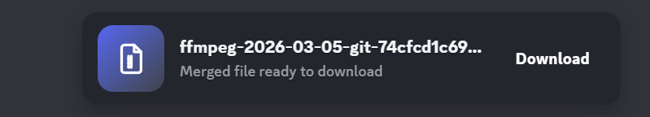

# FileSplitter - Equicord Plugin

FileSplitter is a Equicord plugin that works around Discord's upload limit by splitting large files into 10MB parts on upload, then rebuilding them on the receiving side inside the client.

The project now supports both source-based installs and a release patcher for already-installed clients, so users who do not want to clone/build a repo can still use the full plugin.

## Quick Install

Most users should install with the release patcher from the latest GitHub release:

1. Fully close Discord.
2. Download the patcher for your OS from the [latest release](https://github.com/sioaeko/Equicord-splitLargeFile/releases/latest):
   - Windows: `FileSplitterPatcher.exe`
   - Apple Silicon macOS: `FileSplitterPatcher-macos-arm64.zip`
3. Run the patcher.
4. Choose `Installed Equicord` or `Installed Vencord`.
5. Click `Install / Update`.
6. Reopen Discord and enable `FileSplitter` in the plugin list if it is not already enabled.

If Discord is already running during install, restart it after the patcher finishes. The patcher creates a backup and includes restore/status actions.

## What It Does

- Adds a **Split & Upload** button to the chat bar
- Splits files larger than 10MB into numbered chunk uploads
- Re-detects chunk messages automatically when messages load or channels change
- Rebuilds the original file locally when all parts are available
- Shows a merged **download card** for non-image files
- Shows a merged **inline preview card** for image files
- Keeps the original filename for downloads
- Avoids the old forced auto-download flow for rebuilt files
- Supports installed **Equicord**, installed **Vencord**, and source repo installs
- Includes Windows and Apple Silicon macOS release patchers with backup/restore/status flows

## Screenshots

### Non-image merged result card


### Non-image merged result card on the default Discord theme


### Image merged preview card


### Chunk uploads in chat


### Upload progress toast


### Upload complete toast


## Current Feature Set

### Upload-side behavior

- Files at or below 10MB are left alone and can be sent normally
- Files above 10MB are split into `part001`, `part002`, `part003`, and so on
- Each chunk is uploaded through Discord's normal upload pipeline
- Chunk metadata is sent as JSON message content so the receiving client can reassemble the file
- Upload progress is shown through live toast notifications
- The plugin currently enforces a 500MB per-file soft limit in the UI

### Receive-side behavior

- Existing messages are scanned when the plugin starts
- Existing messages are scanned again when a channel is selected
- Message create and message update events are listened to in real time
- Once every chunk for a file is present, the plugin marks the set as mergeable
- Image files get a rebuilt inline preview card
- Non-image files get a rebuilt download card with a file icon
- Downloads happen only when the user clicks **Download**
- Original chunk rows are hidden once a merged result card is available

### UI behavior

- Image results show a large preview and a bottom action row
- Non-image results show a file-type icon, filename, subtitle, and download button
- Result cards are styled to remain readable on the default Discord dark theme
- Failed rebuilds show an error state with a retry action

### Patcher behavior

- Can patch **Installed Equicord**
- Can patch **Installed Vencord**
- Can copy the plugin into a **Vencord source repo**
- Can copy the plugin into an **Equicord source repo**
- Creates backups for installed-client patching
- Supports restore and status checks from CLI and GUI modes

## Installation Options

There are three supported ways to use FileSplitter.

### Option 1: Release Patcher For Installed Clients

Recommended for most Windows and Apple Silicon macOS users who already use installed Equicord or Vencord.

Download:
https://github.com/sioaeko/Equicord-splitLargeFile/releases/latest

Download the patcher for your OS and choose the mode that matches your setup.

#### Windows

For example, if the exe is in your Downloads folder:

```powershell
cd "$env:USERPROFILE\Downloads"
.\FileSplitterPatcher.exe
```

If you cloned this repository and built the exe locally, use the `dist` path instead:

```powershell
.\dist\FileSplitterPatcher.exe
```

#### Apple Silicon macOS

Download `FileSplitterPatcher-macos-arm64.zip`, unzip it, then run:

```bash
cd ~/Downloads
chmod +x FileSplitterPatcher-macos-arm64
xattr -d com.apple.quarantine FileSplitterPatcher-macos-arm64 2>/dev/null || true
./FileSplitterPatcher-macos-arm64
```

The macOS build is ad-hoc signed by the release workflow, but it is not notarized by Apple. If Gatekeeper blocks it, remove the quarantine attribute with the `xattr` command above and run it from Terminal.

Supported release-patcher targets:

- Installed Equicord
- Installed Vencord
- Source Repo (Vencord)
- Source Repo (Equicord)

#### Installed Equicord / Installed Vencord

1. Fully close Discord.
2. Run the release patcher for your OS from the folder where it was downloaded.
3. Choose `Installed Equicord` or `Installed Vencord`.
4. Click `Install / Update`.
5. Start Discord again.
6. Enable `FileSplitter` in the plugin list if your client requires it.

The patcher stores a backup next to your client files. Use `Restore` in the GUI, or `node patcher.js --restore` / `node patcher.js --restore-vencord`, to undo the patch.

#### Source Repo (Vencord / Equicord)

1. Run the release patcher for your OS.
2. Choose `Source Repo (Vencord)` or `Source Repo (Equicord)`.
3. Select your local repo root.
4. Build/inject your client again.

### Option 2: Userplugin Install From Source

Use this if you already maintain a local Vencord/Equicord source checkout and prefer a normal `src/userplugins` install instead of patching an installed client.

The PR-ready plugin source lives in:

```text
src/equicordplugins/fileSplitter/
```

For personal installs, copy those files into `src/userplugins/fileSplitter/`.
For an Equicord PR, copy the folder into `src/equicordplugins/fileSplitter/`, add yourself to `EquicordDevs`, and target Equicord's `dev` branch.

#### Vencord

1. Clone the Vencord source:
   ```bash
   git clone https://github.com/Vendicated/Vencord.git
   cd Vencord
   ```
2. Create the userplugin folder:
   ```bash
   mkdir -p src/userplugins/fileSplitter
   ```
3. Copy the plugin files:
   ```bash
   curl -o src/userplugins/fileSplitter/index.tsx https://raw.githubusercontent.com/sioaeko/Equicord-splitLargeFile/main/src/equicordplugins/fileSplitter/index.tsx
   curl -o src/userplugins/fileSplitter/native.ts https://raw.githubusercontent.com/sioaeko/Equicord-splitLargeFile/main/src/equicordplugins/fileSplitter/native.ts
   curl -o src/userplugins/fileSplitter/styles.css https://raw.githubusercontent.com/sioaeko/Equicord-splitLargeFile/main/src/equicordplugins/fileSplitter/styles.css
   curl -o src/userplugins/fileSplitter/types.ts https://raw.githubusercontent.com/sioaeko/Equicord-splitLargeFile/main/src/equicordplugins/fileSplitter/types.ts
   ```
4. Build and inject:
   ```bash
   pnpm install
   pnpm build
   pnpm inject
   ```

#### Equicord

1. Clone the Equicord source:
   ```bash
   git clone https://github.com/Equicord/Equicord.git
   cd Equicord
   ```
2. Create the userplugin folder:
   ```bash
   mkdir -p src/userplugins/fileSplitter
   ```
3. Copy the plugin files:
   ```bash
   curl -o src/userplugins/fileSplitter/index.tsx https://raw.githubusercontent.com/sioaeko/Equicord-splitLargeFile/main/src/equicordplugins/fileSplitter/index.tsx
   curl -o src/userplugins/fileSplitter/native.ts https://raw.githubusercontent.com/sioaeko/Equicord-splitLargeFile/main/src/equicordplugins/fileSplitter/native.ts
   curl -o src/userplugins/fileSplitter/styles.css https://raw.githubusercontent.com/sioaeko/Equicord-splitLargeFile/main/src/equicordplugins/fileSplitter/styles.css
   curl -o src/userplugins/fileSplitter/types.ts https://raw.githubusercontent.com/sioaeko/Equicord-splitLargeFile/main/src/equicordplugins/fileSplitter/types.ts
   ```
4. Build and inject:
   ```bash
   pnpm install
   pnpm build
   pnpm inject
   ```

### Option 3: Run The CLI Patcher From This Repo

Use this if you cloned this repository and want to install, restore, or check status from the command line.

```bash
npm install
node patcher.js --help
```

Examples:

```bash
node patcher.js --install
node patcher.js --restore
node patcher.js --status
node patcher.js --install-vencord
node patcher.js --restore-vencord
node patcher.js --status-vencord
node patcher.js --install-source --repo C:\path\to\Vencord
```

Command meaning:

- `--install`: patch installed Equicord
- `--restore`: restore installed Equicord from backup
- `--status`: check installed Equicord patch status
- `--install-vencord`: patch installed Vencord
- `--restore-vencord`: restore installed Vencord from backup
- `--status-vencord`: check installed Vencord patch status
- `--install-source --repo <path>`: copy the source plugin into `src/userplugins/fileSplitter`

For a release binary, the same commands work after replacing `node patcher.js` with the downloaded file path:

```powershell
cd "$env:USERPROFILE\Downloads"
.\FileSplitterPatcher.exe --install
.\FileSplitterPatcher.exe --install-vencord

# Or, from this repository after building:
.\dist\FileSplitterPatcher.exe --install
```

For the Apple Silicon macOS release binary:

```bash
cd ~/Downloads
./FileSplitterPatcher-macos-arm64 --install
./FileSplitterPatcher-macos-arm64 --install-vencord
```

Build release binaries from this repo:

```bash
npm run build:exe
npm run build:mac-arm64

# On macOS, sign the Apple Silicon binary:
npm run build:mac-arm64:signed
```

## How It Works In Practice

### Sending files

1. Click the FileSplitter button in the chat bar.
2. Pick a file larger than 10MB.
3. The plugin splits it into numbered chunk uploads.
4. Each chunk is uploaded like a normal Discord attachment.
5. A small metadata message is posted for each chunk set.

### Receiving files with FileSplitter installed

1. The client finds chunk metadata messages.
2. It tracks all parts for the same original file.
3. After every part is available, it fetches those attachments locally.
4. It rebuilds the original file in memory.
5. It renders either:
   - an inline image preview card, or
   - a non-image file download card.

### Receiving files without FileSplitter

The files are still usable manually. You can download the `.part001`, `.part002`, `.part003`, and later pieces, then join them yourself in order.

#### Windows (CMD)

```cmd
copy /b "filename.part001" + "filename.part002" + "filename.part003" "originalfile"
```

#### Windows (PowerShell)

```powershell
Get-Content "filename.part001","filename.part002","filename.part003" -Encoding Byte -ReadCount 0 | Set-Content "originalfile" -Encoding Byte
```

#### Linux / macOS

```bash
cat filename.part001 filename.part002 filename.part003 > originalfile
```

## Supported Targets

| Target | Supported | Notes |
|------|------|------|
| Installed Equicord | Yes | Supported by the Windows and Apple Silicon macOS release patchers |
| Installed Vencord | Yes | Supported by the Windows and Apple Silicon macOS release patchers |
| Vencord source repo | Yes | Supported by the release patchers and manual install |
| Equicord source repo | Yes | Supported by the release patchers and manual install |
| Plain Discord without Vencord/Equicord | No | The patcher does not install a mod client by itself |

## Technical Details

| Item | Description |
|------|-------------|
| Chunk Size | 10MB |
| Max UI-enforced file size | 500MB |
| File Formats | All file types |
| Image Preview Types | Common inline image formats |
| Metadata Transport | JSON in message content |
| Upload Path | Discord upload pipeline through CloudUploader + RestAPI |
| Rebuild Path | Local fetch + Blob reconstruction |
| Chunk Expiry | 30 minutes |
| Part Naming | `filename.part001`, `filename.part002`, ... |

## Troubleshooting

**Q: I cannot build the plugin from source**
A: Use the release patcher instead. `FileSplitterPatcher.exe` on Windows or `FileSplitterPatcher-macos-arm64` on Apple Silicon macOS is intended specifically for users who do not want to deal with source builds or repo layout changes.

**Q: The plugin does not show up after patching**
A: Fully close Discord, patch the correct target, then restart Discord. If you are using a source repo, rebuild/inject again after copying the plugin.

**Q: Installed patching failed**
A: Make sure you selected the correct installed target: `Installed Equicord` and `Installed Vencord` are separate modes.

**Q: Auto-merge is not happening**
A: All chunks must be available in the same channel, and the receiving client must have FileSplitter installed and active.

**Q: Why does a user without the plugin not see the rebuilt preview card?**
A: The rebuilt result card is local client-side UI. Users without the plugin only see the uploaded chunk files and can still merge them manually.

**Q: Can this patch plain Discord directly?**
A: No. The patcher targets Vencord/Equicord installs or source repos. It does not install a custom client on top of plain Discord by itself.

## Security

- File reconstruction is done locally on the receiving client
- No external merge server is used
- Files are transferred only through Discord's own attachment/CDN flow
- Installed patching creates a local backup before modifying client files

## Credits

- Author: [sioaeko](https://github.com/sioaeko)
- Original concept: [ImTheSquid/SplitLargeFiles](https://github.com/ImTheSquid/SplitLargeFiles)

## License

MIT License
